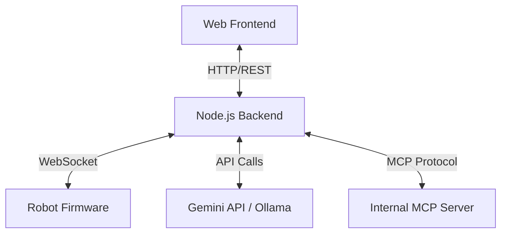

# 系統架構與通訊協定 (Architecture & Protocol)

此文件描述 `chibi-moe` 機器人互動系統的整體架構與模組間的通訊方式。

## 1. 系統組件

系統分為三個主要部分：
1. **Frontend (Web/React Native)**: 使用者介面，提供對話紀錄顯示、模型切換、機器操作按鈕，以及 Web Serial 韌體燒錄介面。
2. **Backend & MCP Server**: Node.js 伺服器，負責維持與機器人的 WebSocket 連線、呼叫 Gemini / Ollama 模型，並實作 MCP Server 以提供硬體操作的 Tool 給 LLM 呼叫。
3. **Robot Firmware**: 機器人硬體（如 ESP32），負責收音、播音及馬達等硬體控制。

## 2. 通訊架構

## 3. 資料流流程

### 3.1 基礎對話 (Phase 1)
1. **輸入**: 機器人收音後，將 PCM 音訊或文字透過 WebSocket `message` 傳送給後端。
2. **處理**: 後端收到訊息，若為音訊則先進行 STT (Speech-to-Text)。接著將文字 prompt 送給 Gemini/Ollama。
3. **輸出**: LLM 生成回覆後，後端透過 TTS 將回覆轉為音訊，再透過 WebSocket 將音訊資料傳回給機器人播放。

### 3.2 機器操作 (Phase 2)
1. 在生成回覆的過程中，LLM 判斷使用者意圖（如「往前走」）。
2. LLM 觸發 MCP Tool 呼叫（如 `move_forward`）。
3. MCP Server 攔截到請求，後端將該控制指令轉換為 JSON 格式，如 `{"cmd": "move", "dir": "forward"}`，並透過 WebSocket 發送給機器人。
4. 機器人接收指令並作動。

## 4. WebSocket 協定草案 (JSON 格式)

所有控制與事件皆以 JSON 格式封裝。

**機器人 -> 後端 (Robot to Backend)**
- 語音資料: `{"type": "audio", "data": "<base64_encoded_audio>"}`
- 狀態回報: `{"type": "status", "battery": 80, "state": "idle"}`

**後端 -> 機器人 (Backend to Robot)**
- 播放語音: `{"type": "audio_out", "data": "<base64_encoded_audio>"}`
- 動作指令: `{"type": "command", "cmd": "move", "dir": "forward", "steps": 2}`
- 表情控制: `{"type": "animation", "id": "happy"}`
